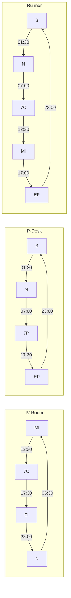
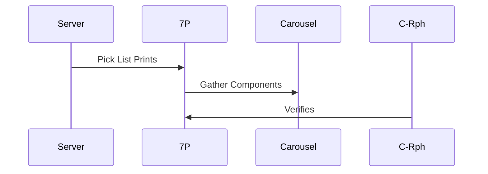
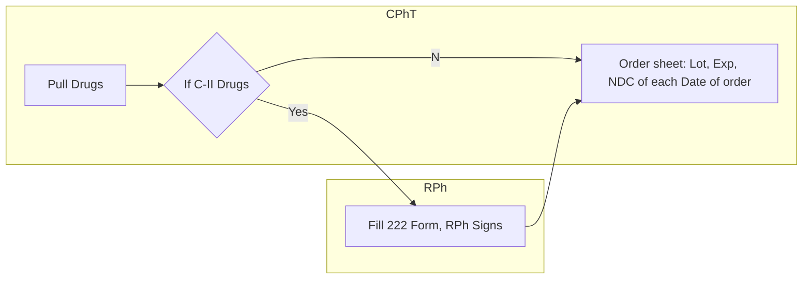

# West ED

```mermaid
graph LR;
   subgraph IV Room
      MI--12:30-->7C--17:30-->EI--23:00-->N--06:30-->MI
   end
   subgraph P-Desk
      7P--17:30-->EP--23:00-->3--01:30-->N2[N]--07:00-->7P
   end
   subgraph Runner
      7C2[7C]--12:30-->MI2[MI]--17:00-->EP2[EP]--23:00-->32[3]--01:30-->N3[N]--07:00-->7C2
   end
```

# Process

```mermaid
sequenceDiagram
   Server->>7P: Pick List Prints
   7P->>Carousel: Gather Components
   C-Rph->>7P: Verifies
```

```mermaid
graph LR;
   subgraph CPhT
      Pull[Pull Drugs] --> DEA{If C-II Drugs}
      DEA --No--> Write[Order sheet: Lot, Exp, NDC of each Date of order]
   end
   subgraph RPh
      DEA --Yes--> DEAform[Fill 222 Form, RPh Signs]
      DEAform --> Write
   end
```

## BUD

Drug | BUD | Fridge
-----|:-----:|---
Bumetanide | 24h
Lacosamide | $$ \red{4h}$$
Alteplase | $\red {8h} $
Daptomycin | 48h | RF
Thiamine | 24h
